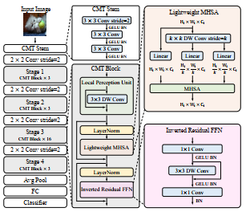
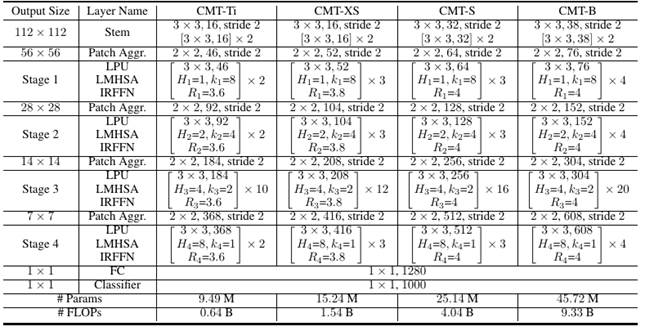

#  ***CMT: Convolutional Neural Networks Meet Vision Transformers***

First of all, thank the authors very much for sharing this excellent paper ***CMT: Convolutional Neural Networks Meet
Vision Transformers*** with us. 

Paper addr: https://arxiv.org/abs/2107.06263

This repository contains unofficial implementation of CMT models without any verification yet. If there are some bug problems in the 
implementation, please send me an email at yuranusduke@163.com or simply add an issue.

## Backgrounds
In this paper, authors design new ViT architecture for object recognition: CMT. CMT uses convolution head as stem
which was proved to be very effective in the former literature. And the whole model is made up of several Patch Aggregation and CMT blocks.
The whole architecture is :



And new version of structures of models with different scales are :



One can read paper carefully to understand how and why they design architecture like this.

## Requirements

```Python
pip install -r requirements.txt 
```

## Implementation

In this repo, I just re-implement the core code in CMT with few modifications,
therefore the number of params may differ from the original paper. And I don't have enough 
computation resources to verify the results from paper, so I just release all my codes to people 
who are interested in running and validating the code on great machines.

### Hyper-parameters and defaults
```bash
--data_root # default is './data/'
--dataset # data set name, default is 'cifar10', also support 'cifar100' and 'imagenet'(which we don't experiment due to limited computation) and 'tiny_imagenet' and 'flowers', also 'cars'
--input_size # default is 160, also support 192, 224, 256, 288
--model_name # default is 'cmt_ti', also support 'cmt_xs', 'cmt_s', 'cmt_b'
--use_gpu # True as default
--n_gpu # default is 1
--batch_size # default is 32
--epochs # default is 160
--optimizer # default is 'adamw', also support 'adam'/'momentum'
--init_lr # default is 1e-5
--gamma # learning rate decay rate, default is 0.2
--milestones # we use steplr decay, default is [30, 60, 90, 120, 150]
--weight_decay # default is 1e-5
```

### Usage

```python
       # 1. Run 
        python main.py main \
            --data_root='./data/' \
            --dataset='cifar10' \
            --input_size=160 \
            --model_name='cmt_ti' \
            --use_gpu=True \
            --n_gpu=1 \
            --batch_size=32 \
            --epochs=160 \
            --optimizer='adamw' \
            --init_lr=1e-5 \
            --gamma=0.2 \
            --milestones=[30,60,90,120,150] \
            --weight_decay=1e-5 \
            --only_test=False

    # 2. Simply run
        python main.py main --dataset='cifar10' --input_size=160 --model_name='cmt_ti' --batch_size=32 --epochs=160  --only_test=False
    # 3. Run scripts
        ./run.sh
```

### Number of Params

<table>
    <tr>
        <td>Model</td>
        <td># of Params</td>
    </tr>
    <tr>
        <td rowspan="1">CMT-Ti</td>
        <td>7.73M</td>
    </tr>
    <tr>
        <td rowspan="1">CMT-XS</td>
        <td>13.1M</td>
    </tr>
    <tr>
        <td rowspan="1">CMT-S</td>
        <td>23.13M</td>
    </tr>
    <tr>
        <td rowspan="1">CMT-B</td>
        <td>40.93M</td>
    </tr>
</table>

## Citation

    @misc{guo2021cmt,
      title={CMT: Convolutional Neural Networks Meet Vision Transformers}, 
      author={Jianyuan Guo and Kai Han and Han Wu and Chang Xu and Yehui Tang and Chunjing Xu and Yunhe Wang},
      year={2021},
      eprint={2107.06263},
      archivePrefix={arXiv},
      primaryClass={cs.CV}}

***<center>Veni，vidi，vici --Caesar</center>***
